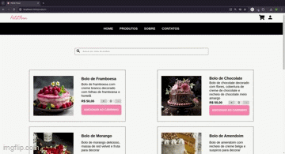
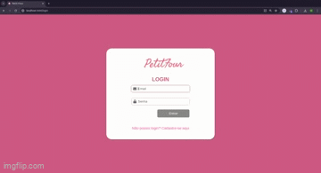
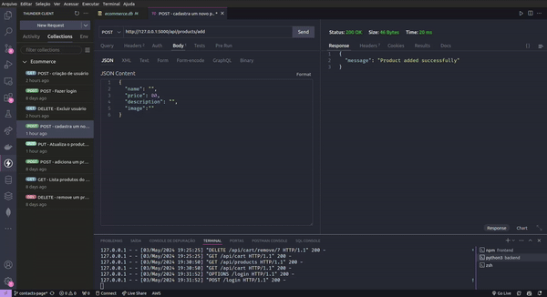
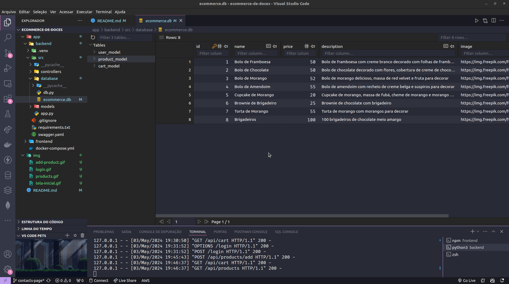
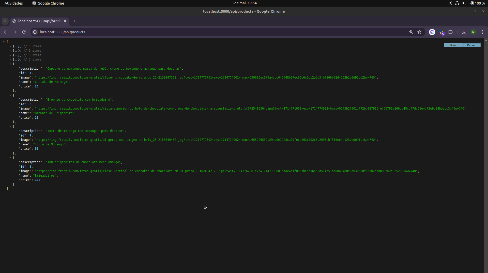

# E-commerce de Doces 🍰🧁🍩 (em construção 🚧 🏗️)

Este é um projeto em construção de um e-commerce de doces. Abaixo estão as instruções sobre como executar o frontend e o back-end localmente e via Docker.

----
## 🖥️ Front-end

<div style="text-align:center;">
    <div style="margin-bottom: 20px;">
        
    </div>
    <div style="margin-bottom: 20px;">
        
    </div>
    <div style="margin-bottom: 20px;">
        
    </div>
</div>

### Tecnologias Utilizadas:

- **Framework Front-end:** React.js
- **Ferramenta de Build:** Vite
- **Linguagem de Programação:** JavaScript
- **Estilização:** CSS

## Preparando Ambiente

<details>
<summary>💻 Executando localmente</summary>

Certifique-se de ter o Node.js instalado em seu sistema.

Você pode baixá-lo em [Node.js](https://nodejs.org/).

1. Clone o repositório para o seu computador: 
`git@github.com:naiaraxavier/ecommerce-de-doces.git`

2. Abra um terminal e navegue até a pasta `frontend` do projeto:
```
cd ecommerce-de-doces/app/frontend
```

3. Instale as dependências do projeto executando o seguinte comando:
```
npm install
```

4. Após a instalação das dependências, inicie o servidor de desenvolvimento local executando:
```
npm run dev
```

5. O servidor de desenvolvimento será iniciado e você poderá acessar o aplicativo em seu navegador acessando 
`http://localhost:3000`.

</details>


<details>
<summary> 🐳 Subindo a aplicação via Docker </summary>

Certifique-se de ter o Docker instalado em seu sistema.

Você pode baixá-lo em [Docker](https://www.docker.com/).

1. Abra um terminal e navegue até a pasta `ecommerce-de-doces/app`, onde se encontra o arquivo `docker-compose.yml`

```
cd ecommerce-de-doces/app
``` 

2. Execute o seguinte comando para iniciar o aplicativo via Docker Compose:
```
docker-compose up -d
```

3. Aguarde até que o Docker construa a imagem e inicie o contêiner. Após a conclusão, você poderá acessar o aplicativo em seu navegador acessando `http://localhost:3000`

</details>

----
## 👩🏽‍💻 Back-end

<div style="text-align:center;">
    
</div>

<div style="text-align:center;">
    
</div>

<div style="text-align:center;">
    
</div>

### Tecnologias Utilizadas:

- **Linguagem de Programação:** Python 🐍
- **Framework Web:** Flask
- **ORM (Object-Relational Mapping):** Flask-SQLAlchemy
- **Autenticação de Usuários:** Flask-Login
- **Biblioteca de manipulação de URLs:** Werkzeug

## Preparando Ambiente

<details>
<summary>💻 Executando localmente</summary>

Certifique-se de ter o Python 3.10 instalado em seu sistema.

1. Clone o repositório para o seu computador: 
`git@github.com:naiaraxavier/ecommerce-de-doces.git`

2. Abra um terminal e navegue até a pasta `backend` do projeto:
```
cd ecommerce-de-doces/app/backend
```

3. Crie o ambiente virtual para o projeto
```
python3 -m venv .venv && source .venv/bin/activate
```

4. Instale as dependências do projeto executando o seguinte comando:
```
python3 -m pip install -r dev-requirements.txt
```

5. Após a instalação das dependências, inicie o servidor de desenvolvimento local executando:
```
python3 src/app.py
```

6. O servidor de desenvolvimento será iniciado e você poderá acessá-lo em: 
`http://127.0.0.1:5000`

</details>

<details>
<summary> 🐳 Subindo a aplicação via Docker </summary>

Em construção🚧 🏗️

</details>
